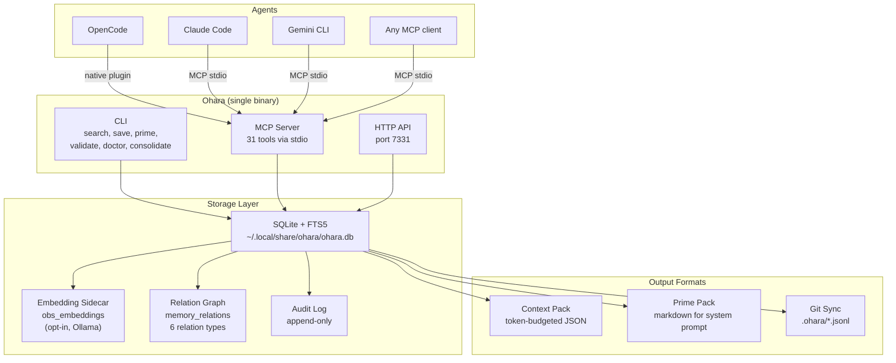
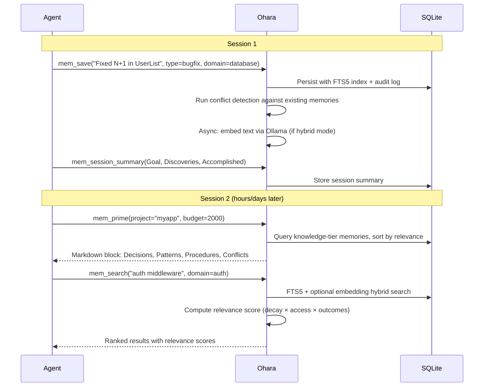
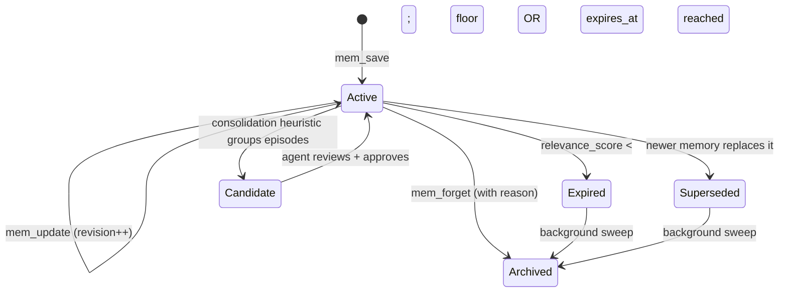

   
  <strong>Ohara</strong> 
  <em>Persistent memory with typed retrieval, conflict detection, and context injection for AI coding agents</em>

---

> **Ohara** is a fork of [**Engram**](https://github.com/Gentleman-Programming/engram) by [**Gentleman-Programming**](https://github.com/Gentleman-Programming). The core memory system and MCP architecture were built by the Engram authors. This fork adds typed memory, conflict detection, relation graphs, hybrid search, and context injection for multi-project, multi-agent workflows.

---

## What It Is

A single Go binary that gives AI coding agents persistent, searchable, structured memory across sessions and projects. One binary, one SQLite file. No runtime dependencies.

Agents forget everything when a session ends. Ohara stores what they learn — architectural decisions, bug fixes, patterns, procedures — and injects relevant context at the start of the next session so they don't repeat mistakes or re-discover what was already known.

## Architecture

## How It Works

### Memory lifecycle

## Memory Model

Ohara uses typed memory kinds, each with different durability and injection priority:

| Kind | What it stores | Default classification | Included in `prime` |
|------|---------------|----------------------|:---:|
| `decision` | Architectural or design choices | foundational | always |
| `procedure` | Verified step-by-step workflows | foundational | always |
| `pattern` | Recurring solutions and conventions | tactical | always |
| `bugfix` | Root cause + resolution of bugs | tactical | always |
| `learned` | Non-obvious discoveries and gotchas | tactical | always |
| `discovery` | Raw session notes and observations | observational | only with `--include-episodes` |

**Classification tiers** control shelf life and injection priority:
- **foundational** — never auto-pruned, always included in context injection
- **tactical** — pruned when relevance decays below threshold
- **observational** — short TTL, excluded from injection by default

## Feature Reasoning

Each feature was motivated by a specific failure mode identified through comparative analysis of [Mulch](https://github.com/jayminwest/mulch), [Graphiti/Zep](https://github.com/getzep/graphiti), [Mem0](https://github.com/mem0ai/mem0), [Letta/MemGPT](https://github.com/letta-ai/letta), and current agent memory research (CoALA, Mem0, MemRL, AgeMem surveys).

### Domain scoping

**Problem**: All memories for a project queried together. As projects grow, search returns noise across unrelated subsystems — auth results mixed with deployment results mixed with database results.

**Why**: Every subsequent feature (consolidation, conflict detection, context injection) becomes more useful when scoped to a domain rather than operating across a flat global pool. Domain is the single highest-leverage field.

### Evidence and provenance fields

**Problem**: Memories have no machine-readable link to commits, issues, or files that justify them. Over time it becomes impossible to audit whether a `decision` is still valid or which file it applies to.

**Why**: Mulch treats evidence as first-class schema. It enables file-targeted context packs, reduces irrelevant retrieval, and makes memories maintainable across code churn.

### Context injection (`ohara prime`)

**Problem**: Raw JSON retrieval wastes context tokens on scaffolding. Agents spend tokens parsing structure instead of acting on substance.

**Why**: Mulch's `prime` emits compact markdown designed for direct injection into a system prompt. The two-tier model (Knowledge tier injected by default, Episode tier opt-in) prevents session noise from crowding out high-signal decisions and patterns.

### Relevance scoring with temporal decay

**Problem**: Two `active` memories treated as equally relevant regardless of access patterns. An 8-month-old unaccessed memory ranks the same as one used yesterday.

**Why**: Research on temporal decay (AgeMem, MemoryAgentBench) shows that scoring by recency + access frequency materially improves retrieval precision. The formula `fts5_rank × decay_factor × log(1 + access_count) × outcome_boost` gives four independent signals.

### Outcome tracking

**Problem**: No feedback loop on whether a memory was *correct*. A bugfix whose resolution was wrong is treated identically to one verified ten times.

**Why**: Evo-Memory research identifies outcome tracking as the simplest precursor to RL scoring. Success/failure counts feed into `outcome_boost` in the relevance formula.

### Actor-aware writes (`written_by`)

**Problem**: Multiple agents (OpenCode, Claude Code, consolidation jobs, git imports) write to the same DB with no source tracking. A consolidation job's inference is treated as user ground-truth at retrieval time.

**Why**: Mem0 Group-Chat v2 identified this as a systematic error vector in multi-agent systems. Tagging writes as `user`, `agent`, `consolidation`, or `import` lets the receiving agent weight inferences lower than verified facts.

### Conflict detection and resolution

**Problem**: Two memories with contradictory advice (e.g., "use WAL mode" vs "disable WAL for replicas") both surface in results with no warning.

**Why**: Mem0's four-choice Update Resolver (add/merge/invalidate/relate/suppress) models all real-world conflict patterns. Surface-time conflict detection catches contradictions that slip through save-time checks.

### Relation graph

**Problem**: All memories are flat rows with no expressed relationships. If a `decision` caused three `bugfix` entries, that structure is invisible.

**Why**: Mem0 graph and MAGMA research show that typed relations (`caused`, `resolves`, `supersedes`, `implements`, `contradicts`) enable traversal queries that flat search cannot answer — "what did this decision lead to?" or "which memories resolve this pattern?"

### Hybrid retrieval (FTS5 + embeddings)

**Problem**: FTS5 is keyword-frequency matching. "Failed auth middleware" misses "JWT verification race condition" despite being semantically identical.

**Why**: Mem0 (arXiv:2504.19413) shows 26% relative improvement in recall with hybrid BM25 + vector retrieval. The zero-LLM-at-retrieval constraint (from Graphiti) keeps query latency deterministic.

### Consolidation

**Problem**: Session memories accumulate as raw episodic records and are never abstracted into durable knowledge. Over time, episode noise crowds out high-signal semantic memories.

**Why**: CoALA and AgeMem research identify episodic-to-semantic consolidation as the highest-leverage improvement for long-running agents. The heuristic grouping step runs in background (sleep-time compute from Letta); agent curation remains mandatory before promotion.

### Secret redaction

**Problem**: Agents may accidentally persist API keys, tokens, or credentials in memory content.

**Why**: Regex-based pre-write redaction (GitHub tokens, OpenAI keys, etc.) runs before any content touches the database. This is defense-in-depth alongside the plugin-side stripping.

## Features

- **Typed memory** — 6 memory kinds (`decision`, `procedure`, `pattern`, `bugfix`, `learned`, `discovery`) with classification tiers (foundational, tactical, observational) controlling shelf life and injection priority
- **Domain scoping** — memories scoped by subsystem (`auth`, `database`, `api`) to prevent cross-concern noise in retrieval
- **Context injection** — `ohara prime` builds token-budgeted markdown packs for direct system prompt injection (Knowledge tier by default, Episode tier opt-in)
- **Relevance scoring** — temporal decay, access frequency, and outcome tracking combine into a composite score that ranks results by actual utility
- **Conflict detection and resolution** — save-time and retrieval-time contradiction surfacing with a 5-action resolver (add, merge, invalidate, relate, suppress)
- **Relation graph** — typed directional links between memories (`caused`, `resolves`, `supersedes`, `implements`, `contradicts`) enabling traversal queries
- **Hybrid retrieval** — FTS5 + optional Ollama embedding sidecar with Reciprocal Rank Fusion, zero LLM calls at query time
- **Consolidation** — heuristic grouping of episodic memories into candidates for promotion to semantic knowledge, with mandatory agent review
- **Actor-aware writes** — source tracking (`user`, `agent`, `consolidation`, `import`, `system`) so agents can weight inferences lower than verified facts
- **Secret redaction** — regex-based pre-write redaction strips tokens and keys before they touch the database
- **31 MCP tools** — save, search, retrieve, link, consolidate, feedback, outcomes, conflict resolution, entity extraction, graph traversal, session lifecycle
- **Multi-agent** — OpenCode native plugin, MCP stdio for Claude Code / Gemini CLI / any MCP client, HTTP API
- **Git sync** — JSONL mirror for repo-portable project memory with union merge strategy
- **Schema validation and health checks** — `ohara validate` for CI, `ohara doctor --fix` for periodic maintenance

## Fork Status

Personal fork of Engram. Source-build only. No TUI or marketplace. Tracks upstream selectively.

## License

MIT (same as upstream Engram)
